# Polyglot: Bio-inspired Visual Analysis of Language Embedding Data

[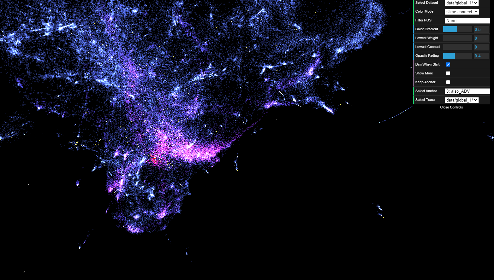](image/1_tool_overview.PNG)

Polyglot is a web application for visualizing language embeddings in a 3D space. Language embeddings are typically high-dimensional vector representations of the syntactic and semantic content of words. This application allows examination of a particular word embedding data, reduced to 3D using [UMAP](https://arxiv.org/abs/1802.03426). In addition to 3D navigation of the scatter plot space, the application also allows the user to view the exploration result of [Monte-Carlo Physarum Machine (MCPM)](https://arxiv.org/abs/2009.02459). The algorithm is a computational model simulating the self-organizing nature of slime mold. It has been shown to discover structures of underlying data following the characteristics of optimal transport networks. Lastly, the application also allows viewing the dataset by coloring based on each word's part-of-speech tag.

For this application, we use [Gensim Continuous Skipgram result of Wikipedia Dump of February 2017 (296630 words)](http://vectors.nlpl.eu/repository/). The same dataset is reduced twice using UMAP under the same parameter (can be switched using _Select Dataset_) to example the persistence of underlying structures. 

Use mouse hover to examine the content of each word point. The toggle _Show More_ displays all the word tokens under the mouse point, not just the one closest to the screen.

One can switch between examining slime exploration result and part-of-speech distributions using _Color Mode_. The four sliders (_Color Gradient_, _Lowest Weight_, _Lowest Connect_, _Opacity Fading_) can be used to customize the visualization of the slime results. Specifically, _Lowest Connect_ is particularly helpful to declutter the scatter plot view.

The slime result is generated by placing MCPM probe agents around a single word point, which we call anchor point, and allow them to spread out and follow the trace. The anchor points are marked yellow. Hold Left-Shift to enter anchor point navigation mode. Double click on an anchor point to switch to the slime mode result for that particular point.

## Web Application

You can use the web application by going to: [https://creativecodinglab.github.io/Polyglot/index.html](https://creativecodinglab.github.io/Polyglot/index.html) 

## Quick Reference 
Mouse: navigate in 3D  
Left-Shift: anchor-focus mode 

Double click on anchor points (yellow) to view slime data from that anchor point.

## Screenshots

[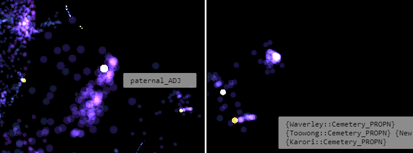](image/2_tool_hover.png)

[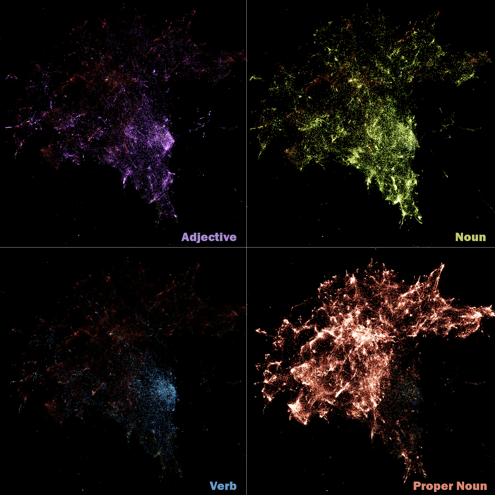](image/3_tool_pos.png)

[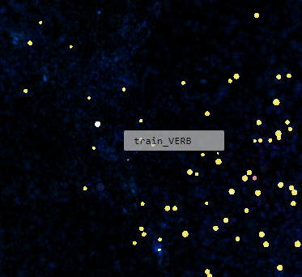](image/4_shift_anchor.png)

[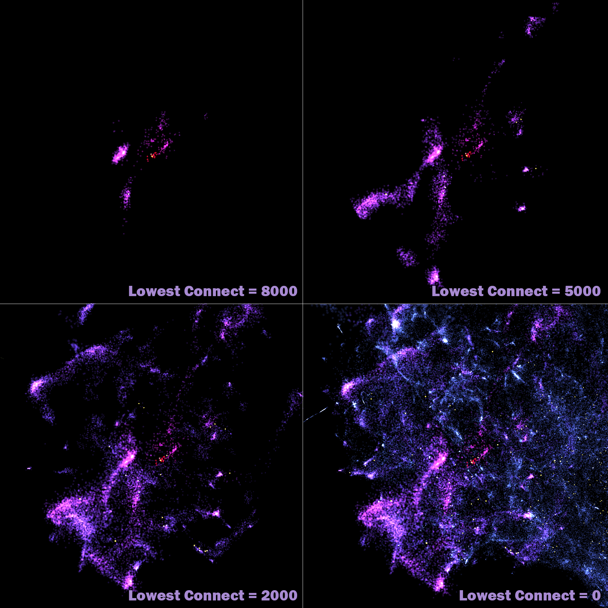](image/5_lowest_conn.png)

[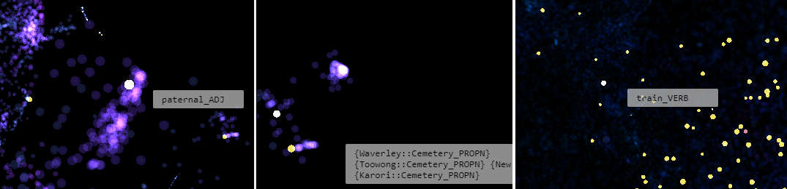](image/6_combined.png)

[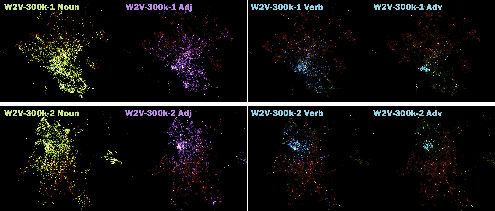](image/8_onevstwomix_inverse.png)

[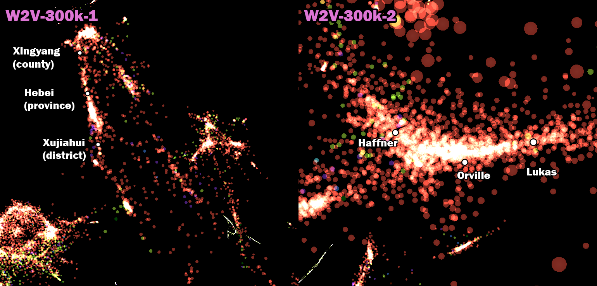](image/10_proper-noun.png)

[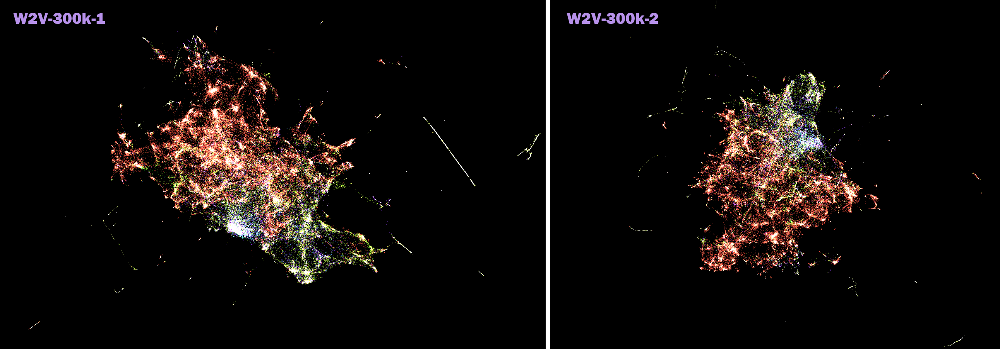](image/11_onevstwo_total.png)

[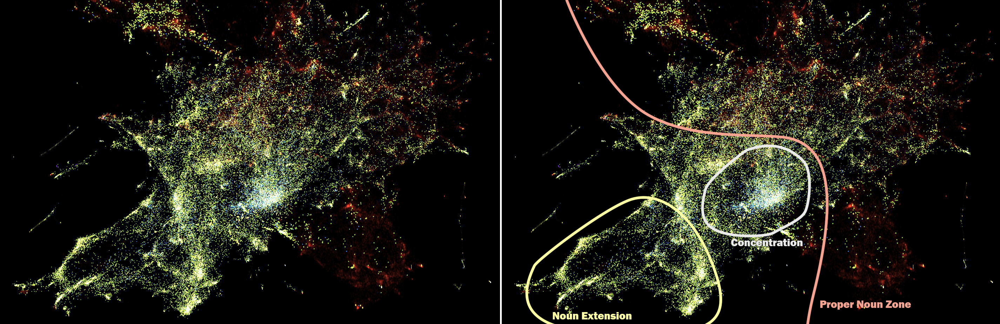](image/global-1-demo.png)

[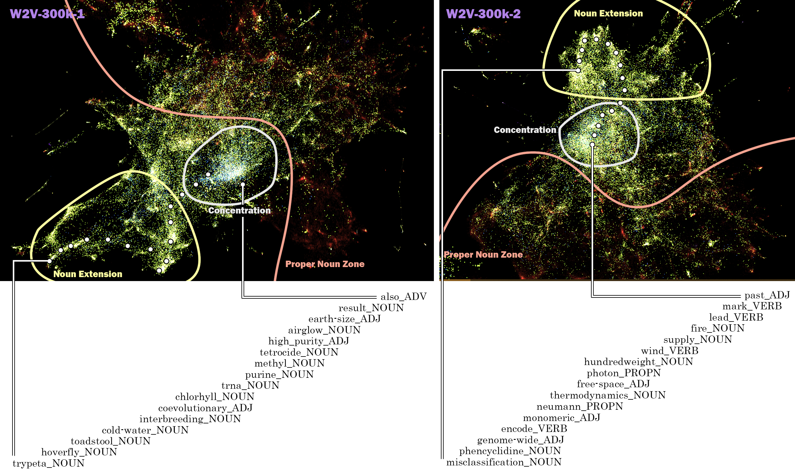](image/global-together-more.png)

## Authors

This web visualization tool was created by a team of researchers at University of California, Santa Cruz, Dept. of Computational Media:

- Hongwei (Henry) Zhou
- [Oskar Elek](https://elek.pub/)
- [Angus G. Forbes](https://creativecoding.soe.ucsc.edu/angus/)

This work was published as Hongwei Zhou's [M.S. thesis](https://escholarship.org/uc/item/6zj1r9ch#main).

A version of this work was published in [2020 IEEE 5th Workshop on Visualization for the Digital Humanities (VIS4DH)](https://www.computer.org/csdl/proceedings-article/vis4dh/2020/915300a007/1pZ0Xs0EEqk)
